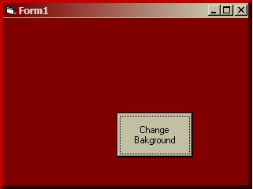

<div align="center">

## Color your Form's Border Based on the Background Color


</div>

### Description

Ever get frustrated that when you change the background color of a form the forms border doesn't change as well. Now it can.
 
### More Info
 


<span>             |<span>
---                |---
**Submitted On**   |2004-01-26 10:18:42
**By**             |[james kahl](https://github.com/Planet-Source-Code/PSCIndex/blob/master/ByAuthor/james-kahl.md)
**Level**          |Beginner
**User Rating**    |4.3 (13 globes from 3 users)
**Compatibility**  |VB 3\.0, VB 4\.0 \(16\-bit\), VB 4\.0 \(32\-bit\), VB 5\.0, VB 6\.0
**Category**       |[Custom Controls/ Forms/  Menus](https://github.com/Planet-Source-Code/PSCIndex/blob/master/ByCategory/custom-controls-forms-menus__1-4.md)
**World**          |[Visual Basic](https://github.com/Planet-Source-Code/PSCIndex/blob/master/ByWorld/visual-basic.md)
**Archive File**   |[Color\_your1699791262004\.zip](https://github.com/Planet-Source-Code/james-kahl-color-your-form-s-border-based-on-the-background-color__1-51252/archive/master.zip)

### API Declarations

```
GetSystemMetrics
GetWindowDC
ReleaseDC
CreatePen
DeleteObject
SelectObject
LineTo
OleTranslateColor
```


